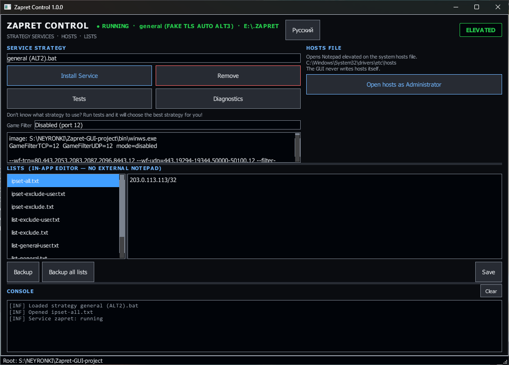

# Zapret Control (GUI)

Удобный графический интерфейс для управления Zapret на Windows: установка службы в один клик, выбор стратегий, редактирование списков и быстрый доступ к `hosts`.



---

> [!WARNING]
> ### 🛑 ВАЖНЫЙ ДИСКЛЕЙМЕР
> Проект предоставлен «как есть» (AS IS). Если у тебя на компьютер закрадётся вирус/троян/майнер или взорвётся дом — я предупредил.
> 
> *Кстати, занятный вопрос: если на трансформаторной будке написано «Не влезай — убьёт!», а ты всё равно лезешь, то кто виноват? 🤔*
> 
> - **Не нравится — не используй.** Никто никого не заставляет.
> - Если у тебя «ничего не работает» — это твои личные проблемы. У меня всё работает.
> - Хотелки и бессмысленные Pull Requests закрываются без обсуждения.

<details>
<summary><b>🔧 Решение проблемы «У меня ничего не работает»:</b></summary>

<br>

<p align="center">
  
</p>

</details>

---

## 🚀 Запуск

Просто запустите **`ZapretControl.bat`** — он один раз запросит права администратора (так же, как это делает `service.bat`), проверит окружение, при необходимости доустановит библиотеки через `pip install -r requirements.txt` и запустит `python -m zapret_gui`.

Права нужны потому, что `sc create` / `sc start` / `sc stop` без них выполняются в отдельном UAC-окне, вывод которого GUI прочитать не может. С правами каждый вызов `sc.exe` идёт внутри процесса, и его настоящий вывод попадает в консоль приложения.

Если UAC не нужен (CI, `--smoke`, либо путь `--root` с пробелами — он не переживает перезапуск), передайте `--no-elevate`:
```bat
ZapretControl.bat --no-elevate --smoke
```

Либо вручную из консоли:
```bat
pip install -r requirements.txt
python -m zapret_gui
```

---

## 🎮 Кнопки и возможности

- **Выбор стратегии:** Выпадающий список всех файлов `general*.bat` из папки с авто-подстановкой аргументов.
- **Строка состояния:** Рядом с заголовком всегда видно состояние службы (`РАБОТАЕТ` / `ОСТАНОВЛЕНА` / `НЕ УСТАНОВЛЕНА` …) и установленную стратегию; если служба установлена из другой папки, показывается и эта папка. Обновляется каждые 2 секунды напрямую через `QueryServiceStatusEx`, без запуска `sc.exe`; `F5` — обновить сразу.
- **Установить службу:** Устанавливает и запускает службу — пункт 1 меню `service.bat` шаг в шаг: `netsh … timestamps=enabled`, `sc stop`, `sc delete`, `sc create … start= auto`, `sc description`, **`sc start`**, запись имени стратегии в реестр (`zapret-discord-youtube`). Как `net stop` в `service.bat`, после `sc stop` ждёт полной остановки, а после `sc delete` — исчезновения записи: иначе при замене работающей службы `sc create` получает `1072`. В конце служба опрашивается до `RUNNING`: `sc start` возвращает управление ещё на `START_PENDING`, поэтому только запрос состояния доказывает, что `winws.exe` выжил.
- **Удалить (Remove):** Останавливает и удаляет службу, завершает `winws.exe` и снимает драйверы `WinDivert` — пункт 2 меню. Как и в `service.bat`, каждый шаг выполняется, даже если предыдущий не удался; итог определяется проверкой, что службы `zapret` больше нет.
- **Тесты:** Пункт 12 меню — открывает `utils\test zapret.ps1` в отдельном окне PowerShell. Скрипт не запустится, пока установлена служба `zapret`, поэтому сначала нажмите «Удалить». Когда прогон закончится, GUI прочитает строку `Best strategy:` из файла результатов и выберет лучшую стратегию в списке; установка остаётся за вами.
- **Диагностика:** Пункт 11 меню в консоли приложения: те же проверки в том же порядке и с тем же текстом (BFE, прокси, TCP timestamps, Adguard, Killer, Intel, Check Point, SmartByte, кириллица и OneDrive в пути, VPN, защищённый DNS, hosts, конфликт WinDivert). Два вопроса `service.bat` становятся диалогами с теми же ответами по умолчанию: удалить конфликтующие службы — «Нет», очистить кэш Discord — «Да».
- **Консоль:** Нижняя панель показывает каждую выполненную команду и её настоящий вывод — то же, что видно в окне `service.bat`. Зелёный `[ OK ]`, жёлтый `[WARN]` для необязательных шагов, красный `[FAIL]`. Коды `sc` расшифровываются словами (`1053` → «служба не ответила на запрос запуска вовремя»).
- **Game Filter (Игровой фильтр):** Режимы фильтрации игровых портов (`disabled` / заглушка порт `12`, `tcp`, `udp`, `all`).
- **Открыть hosts:** Безопасное открытие файла `hosts` в Блокноте с правами администратора.
- **Списки (Встроенный редактор):** Выбор любого файла из `lists/`, редактирование на месте, сохранение (`Save` / `Ctrl+S`), резервная копия файла (`Backup`) и бэкап всех списков в zip (`Backup all lists`).
- **Язык (Русский / English):** Переключение языка интерфейса в один клик.

---

## 🔗 О работе самого Zapret

Этот репозиторий — **только оболочка (GUI)**. Вся информация о принципах работы самого Zapret, подборе стратегий и параметрах `winws.exe` находится у авторов:
- [bol-van / zapret](https://github.com/bol-van/zapret) — оригинальный движок
- [Flowseal / zapret-discord-youtube](https://github.com/Flowseal/zapret-discord-youtube) — сборка стратегий
