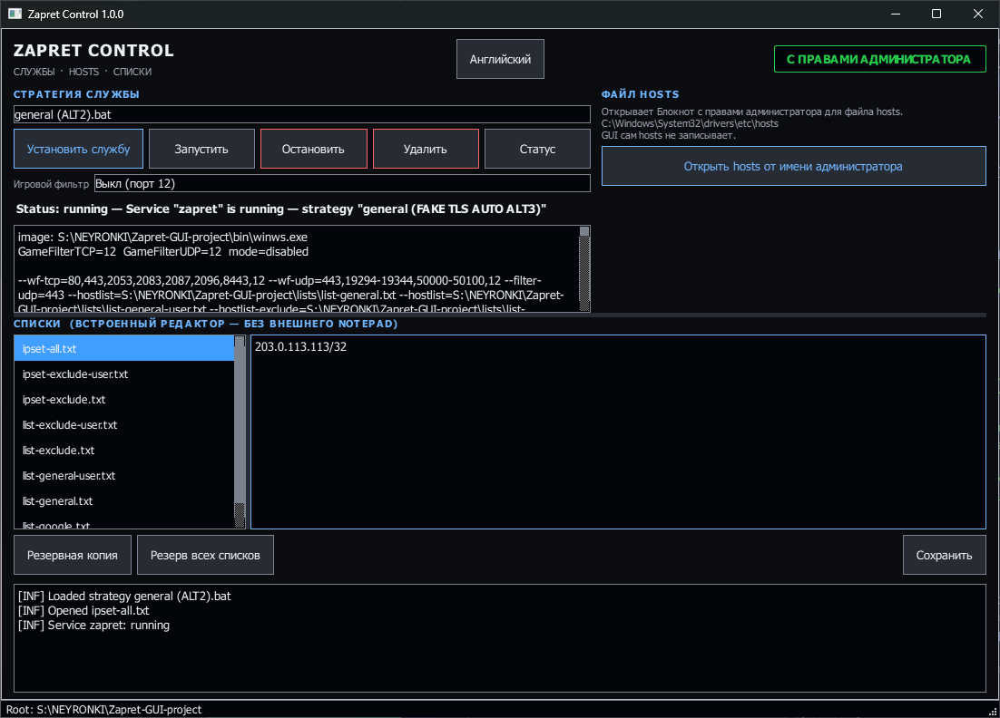

# Zapret Control (GUI)

Графический интерфейс для управления деревом Zapret в среде Windows: управление системными службами, редактирование списков обхода и безопасный доступ к файлу `hosts`.



---

> [!WARNING]
> ### 🛑 ВАЖНЫЙ ДИСКЛЕЙМЕР / ДЛЯ КОГО ЭТО СДЕЛАНО
> 
> Проект разрабатывался **исключительно для себя** и под свои личные задачи и сценарии.
> 
> **Коротко и доходчиво:**
> - **Не нравится — не используй.** Никто никого не заставляет.
> - Если у тебя «ничего не работает», «провайдер всё равно блочит», «сайт X не грузится» — **не нужно открывать Issues**. Проблема в 99.9% случаев на стороне твоего провайдера, структуры твоего сетевого подключения, блокировок ТСПУ или неумения подобрать рабочую стратегию под свою сеть.
> - Бессмысленные **Pull Requests** и **Issues** с требованиями «добавьте вот такую фичу», «переделайте дизайн», «перепишите на Electron/C#/Go» рассматриваться не будут и закрываются сразу.
> - Код распространяется по принципу **«КАК ЕСТЬ» (AS IS)**. У автора всё работает так, как было задумано — следовательно, цель проекта полностью достигнута.

<details>
<summary><b>🔧 Универсальная инструкция по решению проблемы «У меня ничего не работает»:</b></summary>

<br>

<p align="center">
  
</p>

</details>

---

## ⚡ Описание и возможности GUI

Zapret Control представляет собой надстройку на **PySide6 (Qt)**, созданную для того, чтобы полностью исключить необходимость ручной возни с терминалом, пакетными `.bat` файлами и правами администратора при использовании Zapret на Windows.

Программа **не переписывает** сетевой движок `winws.exe` и драйвер WinDivert, а берет на себя всю рутину управления:
- Автоматически считывает все стратегии `general*.bat` в каталоге, разбирает их параметры и отображает финальные аргументы.
- Взаимодействует с Windows Service Control Manager (`sc.exe`), создавая, запуская, останавливая и удаляя службу `zapret` в один клик.
- Позволяет на лету переключать игровой фильтр (**Game Filter**).
- Предоставляет встроенный редактор для любых списков из каталога `lists/` без запуска внешних блокнотов.
- Позволяет безопасно открыть системный файл `hosts` с запросом прав администратора.
- Имеет полноценную поддержку двух языков интерфейса: **Русский** и **English**.

---

## 🚀 Установка и запуск

### Быстрый запуск (рекомендуется)

Просто запустите файл **`ZapretControl.bat`** двойным кликом:

```bat
ZapretControl.bat
```

Лаунчер автоматически:
1. Проверит наличие установленного Python (требуется версия 3.10+).
2. Проверит наличие всех библиотек и при необходимости сам установит их через `pip install -r requirements.txt`.
3. Запустит графическую оболочку `python -m zapret_gui`.

### Ручной запуск через консоль

Установка зависимостей:
```bat
pip install -r requirements.txt
```

Запуск приложения:
```bat
python -m zapret_gui
```

---

## 📖 Как пользоваться GUI и назначение кнопок

### 1. Верхняя панель (Заголовок и статус)

- **Кнопка переключения языка (`Русский` / `English`):** Мгновенно переключает язык всех элементов интерфейса на лету без перезапуска.
- **Индикатор привилегий (`С ПРАВАМИ АДМИНИСТРАТОРА` / `НЕТ ПРАВ АДМИНИСТРАТОРА`):** Зеленый индикатор (`ELEVATED`) показывает, что программа работает с правами администратора. Красный индикатор указывает на запуск с правами обычного пользователя.
- **Кнопка `Перезапустить от имени администратора (Relaunch as Administrator)`:** Отображается только тогда, когда GUI запущен без повышенных привилегий. Нажатие вызывает стандартный системный диалог UAC Windows и перезапускает интерфейс с правами администратора.

---

### 2. Секция «СТРАТЕГИЯ СЛУЖБЫ» (Service Strategy)

Управляет фоновой системной службой Windows для автоматического применения обхода блокировок:

- **Выпадающий список стратегий:** Автоматически находит все сценарии `general*.bat` в корне репозитория (например, `general.bat`, `general (ALT).bat`, `general (FAKE TLS AUTO ALT3).bat` и др.). При смене стратегии интерфейс парсит параметры запуска `winws.exe`, заменяет переменные окружения на полные пути и выводит результат в окно предпросмотра.
- **`Установить службу (Install Service)`:** 
  Останавливает и удаляет предыдущую службу (если она существовала) и регистрирует новую службу Windows под именем `zapret` с автоматическим типом запуска (`start= auto`) и исполняемым файлом `bin\winws.exe` с выбранными аргументами. Также записывает идентификатор стратегии в ветку реестра `HKLM\SYSTEM\CurrentControlSet\Services\zapret` со значением `zapret-discord-youtube` (полная совместимость со скриптом `service.bat`).
- **`Запустить (Start)`:** Запускает службу Windows (`sc start zapret`).
- **`Остановить (Stop)`:** Корректно останавливает службу Windows (`sc stop zapret`).
- **`Удалить (Remove)`:** 
  Выполняет полную чистку системы: останавливает и удаляет службу `zapret`, принудительно завершает оставшиеся процессы `winws.exe`, а также корректно останавливает и удаляет службы драйверов перехвата пакетов `WinDivert` и `WinDivert14`.
- **`Статус (Status)` (или клавиша `F5`):** Опрашивает Service Control Manager (`sc query zapret`) и отображает текущее состояние: работает (`running`), остановлена (`stopped`) или не установлена (`not installed`).
- **Выпадающий список `Игровой фильтр (Game Filter)`:**
  Управляет фильтрацией игрового трафика (`utils\game_filter.enabled`). Доступны четыре режима:
  - `Выкл (порт 12)` / `disabled` — фильтр отключен (фиктивный порт `12`).
  - `TCP и UDP` / `all` — фильтрация диапазонов портов `1024-65535` для обоих протоколов TCP и UDP.
  - `только TCP` / `tcp` — фильтрация TCP портов `1024-65535`.
  - `только UDP` / `udp` — фильтрация UDP портов `1024-65535`.
  *(После изменения режима переустановите службу или перезапустите её кнопками «Остановить» -> «Запустить»)*.
- **Окно предпросмотра аргументов:** Показывает точную строку параметров, с которой запускается `winws.exe`.

---

### 3. Секция «ФАЙЛ HOSTS» (Hosts File)

- **`Открыть hosts от имени администратора (Open hosts as Administrator)`:**
  Запускает стандартный `Notepad.exe` с системным файлом `C:\Windows\System32\drivers\etc\hosts`, автоматически запрашивая права администратора через UAC.
  *Примечание:* Сам GUI напрямую в файл hosts ничего не записывает, гарантируя безопасность и сохранность системных файлов.

---

### 4. Секция «СПИСКИ» (Lists Editor — Встроенный редактор)

Позволяет редактировать домены, подсети и списки исключений прямо в интерфейсе программы:

- **Список файлов (слева):** Отображает доступные списки из директории `lists/` (`list-general.txt`, `list-general-user.txt`, `list-exclude.txt`, `ipset-all.txt` и др.).
- **Редактор текста (справа):** Встроенное поле для быстрого добавления или удаления адресов и доменов.
- **`Сохранить (Save)` (или сочетание клавиш `Ctrl+S`):** Записывает внесенные в редакторе изменения в текущий открытый файл.
- **`Резервная копия (Backup)`:** Создает резервную копию открытого файла с временной меткой в имени (`файл.YYYYMMDD-HHMMSS.bak`).
- **`Резерв всех списков (Backup all lists)`:** Упаковывает все файлы каталога `lists/` в единый zip-архив в папку `lists/backups/`.

---

### 5. Нижняя консоль (Журнал логов)

Отображает подробную информацию о выполнении системных операций, ответы SCM, диагностические сообщения и возможные ошибки.

---

## 🔗 Информация об оригинальном Zapret

Данный проект — это **исключительно графическая оболочка (GUI)** и лаунчер для облегчения взаимодействия со службами и списками на Windows.

Вся информация о принципах работы самого Zapret, механизмах обхода блокировок, DPI-сигнатурах и детальном синтаксисе аргументов `winws.exe` находится в оригинальных репозиториях:
- **Оригинальный проект zapret (автор bol-van):** [https://github.com/bol-van/zapret](https://github.com/bol-van/zapret)
- **Сборка zapret-discord-youtube (автор Flowseal):** [https://github.com/Flowseal/zapret-discord-youtube](https://github.com/Flowseal/zapret-discord-youtube)
